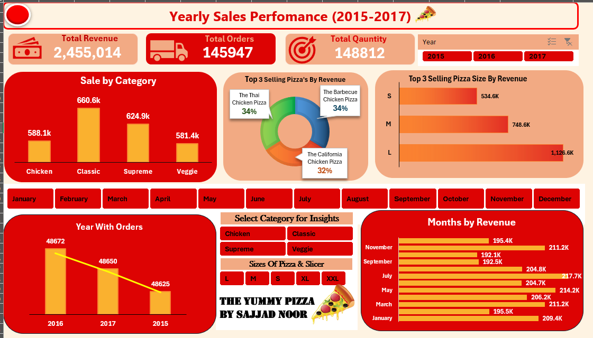

  🍕 Pizza Sales Dashboard (2015–2017)

📊 Project Overview
This project presents an **interactive Excel dashboard** built to analyze **three years of pizza sales data (2015–2017)**.  
The goal was to combine, clean, and analyze data from multiple years using **Power Query** and visualize meaningful insights through **Excel charts, slicers, and KPIs**.

---

🔍 Objective
To identify sales trends, top-performing pizza categories, and size-wise revenue performance using dynamic Excel tools.  
The dashboard enables users to explore the data through slicers and visualize year-wise and month-wise performance metrics.

---

🧠 Insights & Features
- **Total Revenue:** 2,455,014  
- **Total Orders:** 145,947  
- **Total Quantity Sold:** 148,812  
- **Year Slicer:** 2015, 2016, 2017  
- **Sales by Category:** Chicken, Classic, Supreme, Veggie  
- **Top 3 Selling Pizzas by Revenue:** Thai Chicken Pizza, Barbecue Chicken Pizza, California Chicken Pizza  
- **Top 3 Pizza Sizes by Revenue:** S, M, L  
- **Month Slicer:** January – December  
- **Year-wise Orders Chart**  
- **Category & Size Slicers**  
- **Monthly Revenue Chart**

---

🛠 Tools & Techniques
- **Microsoft Excel**
  - Pivot Tables  
  - Charts & Conditional Formatting  
  - Slicers for interactivity  
- **Power Query**
  - Data Cleaning & Transformation  
  - Merging multiple years into one dataset  
- **Data Analysis**
  - KPI calculation (Revenue, Orders, Quantity)  
  - Trend and performance visualization  

---

 📈 Key Learnings
- Combining multi-year data using Power Query  
- Designing an interactive Excel dashboard  
- Analyzing business performance through data visualization  
- Using slicers and charts for dynamic filtering  

---

📷 Dashboard Preview

### 📂 Download Dashboard
You can download and explore the full **Excel Dashboard (Pizza Sales Dashboard)** using the link below.  
It’s hosted safely on Google Drive with **Viewer access**, so you can download it without any changes to the file.

➡️ [🔗 Download Dashboard from Google Drive](https://drive.google.com/file/d/1UoDpmGD29fZkrBwLnewsTfQvU_VhamQi/view?usp=sharing)

---

 Author
**Sajjad Noor**
📍 Data Analyst | Excel | Power Query | Data Visualization  
🔗 [LinkedIn Profile](https://www.linkedin.com/in/sajjad-noor-1b9646372)

💬 Summary
This dashboard highlights how Excel and Power Query can turn raw sales data into **actionable business insights**.  
It provides a clear picture of which **years, months, pizza categories, and sizes** performed best and supports data-driven decision-making in a visually engaging way.

